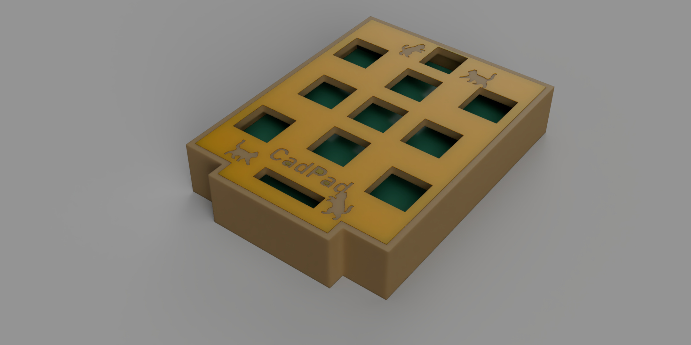
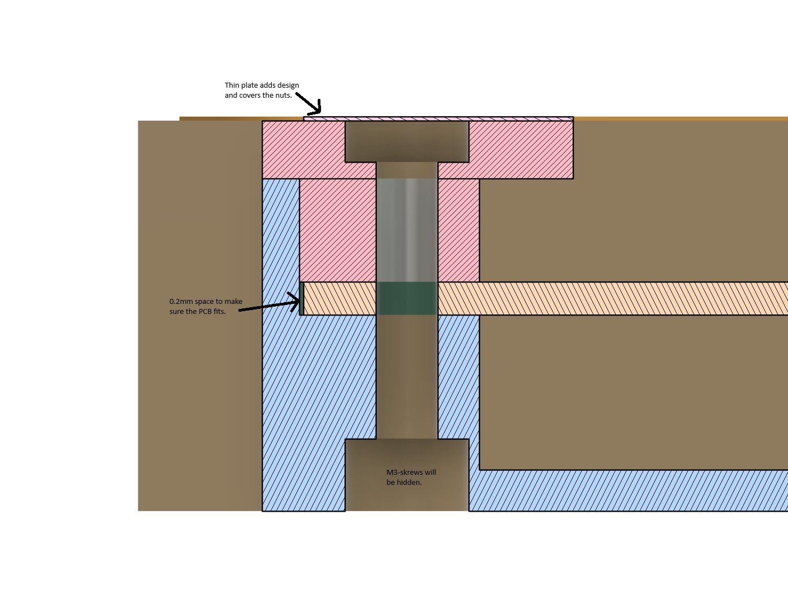
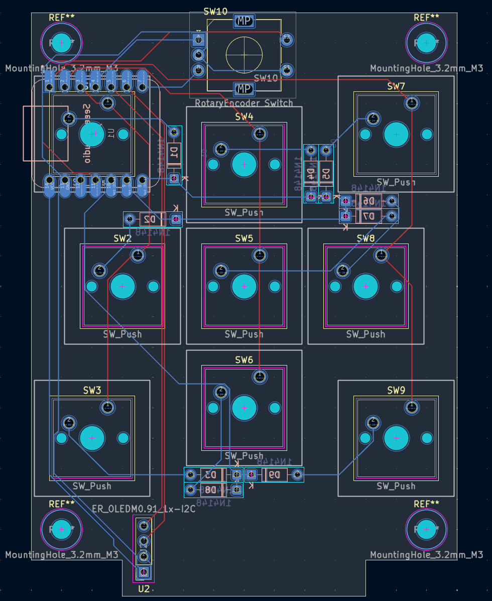

# CadPad
**This is my own macropad called CadPad.**

CadPad is designed to provide shortcuts in CAD, but also works for other things by mapping it to anything you want. It is also my very first PCB design.

### Problems I faced
I had a really fun time making the PCB, it was my first time, but thanks to the good introduction an the intuitive software, it turned out pretty well.(I think, we'll see when I get the real ones.)
I'm also completely new to QMK-firmware and compiling. I have done a lot of programming before, mainly with micropython/circuitpython/python, but this was something new. I can't tell how happy I was when the console filled up with [OK].

I wanted to try a kind of mounting that I have never used before. The nut and end of the screw will be covered by a thin plate that also adds some design to the project. This will require me to cut the screws in exact lenghths. The section analysis is slightly outdated, I have for example added some space between the top and base, the vertical ble/pink line.

### BOM
|Unit|Amount|
|:----|:----|
|Cherry MX Switch|9x|
|XIAO rp2040|1x|
|Blank DSA Keycap|9x|
|M3x16 Bolt|4x|
|M3 Nut|4x|
|1N4148 DO-35 Diodes|9x|
|EC11 Rotary Encoder|1x|
|2.54mm straight pin header|18x|
#### I will also use/need
* 3D printed parts
* Custom PCB
* QMK firmware
* Soldering iron

### Current state

I'm done with designing PCB, case and firmware. The current version has two layers, for CAD and normal use, this will be modified later.

Below is a screenshot of the current PCB routing, I had tho change the placing of the diodes, as the may be in the way of the buttons.

### The future
I will definitly change the firmware a bit once I have tested the functionality, add an animation to the OLED and update the keymap. But it will get a lot easier once I have the physical product to test on.
